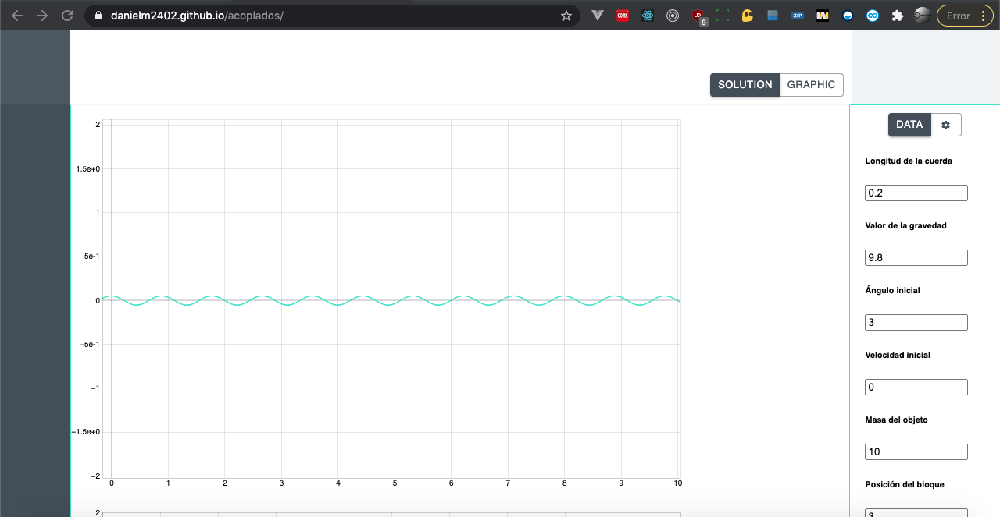

# [Non Responsive coupled calculator](https://danielm2402.github.io/acoplados/)
Coupled pendulum equations calculator
## [Try it yourself](https://danielm2402.github.io/acoplados/)

## Features
* [ReactJS]
* [React-router]
* [Mathjax]
* [Function-plot]

## Install

Construction and testing of the project requires [node.js](http://nodejs.org/download/). `npm install -g npm@latest`.

Run project:

1. `npm run start`

## Screenshots

Sorry for not making the project responsive, time is short.

